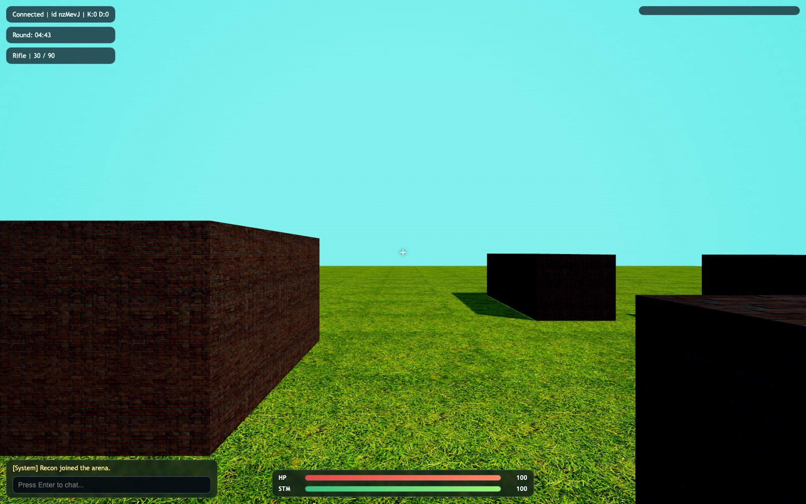

# Browser FPS with an authoritative server

A multiplayer first-person shooter that runs in the browser, built from scratch
on Node + Socket.io + Three.js. The point of the project is the netcode: the
server simulates the whole game at a fixed 60 Hz and is the only authority on
where players are, what they hit, and how much damage they take. The client
sends input and draws what the server sends back. It does not decide anything
that matters.



## Why this way

Most student FPS projects are client-authoritative: the browser tells the server
"I moved here" and "I hit that guy", and the server believes it. That is easy to
build and trivial to cheat -- a modified client can teleport or claim any hit.
This project takes the other route: the client is untrusted and the server owns
the truth, so hit registration and occlusion are decided in one place instead of
on the client's word.

## The model

**The server owns the simulation.** `server.js` runs a fixed-timestep loop at
60 Hz (`setInterval`, `dt = 1/60`). Every tick it advances each player:
horizontal acceleration with separate ground and air values, gravity and jumping,
an air-speed cap, ground friction, stamina-gated sprinting, and per-axis AABB
collision against the static map obstacles (X and Z resolved separately so you
slide along walls instead of sticking). Then it broadcasts a snapshot of every
player to everyone with `io.volatile.emit` -- volatile so a late frame is dropped
rather than queued, which is what you want for state that's about to be replaced.

**The client is a thin, interpolating renderer.** `public/client.js` samples the
keyboard and mouse at 60 Hz, turns WASD into a camera-relative world-space
direction, and sends `{ moveX, moveZ, yaw, pitch, jump, sprint }`. That's all it
sends. It does not simulate its own position -- it renders the authoritative
snapshot, easing every player (itself included) toward the latest server position
each frame (`lerp`, alpha 0.85), and it ignores any snapshot with a sequence
number it has already seen. The one thing the client owns outright is the camera
look: mouse movement updates yaw/pitch locally with no round-trip, so aiming
feels instant, and that same yaw/pitch is sent up so the server aims your shots
from the same angle you see.

**Hit registration is server-side and occlusion-aware.** When you click, the
client emits `shoot` -- no coordinates, no hit claim. The server ray-marches from
the shooter's eye along its authoritative aim direction and, for every other live
player, does a ray-vs-sphere test against two hitboxes: a body sphere and a
smaller head sphere higher up (headshots do more damage). Before it credits a
hit, it also casts the ray against the map obstacles (ray-vs-AABB) to get the
distance to the first wall, and a player only counts as hit if they are nearer
than that wall. So you cannot shoot someone through a crate. Damage, kills, the
kill feed and respawn timers are all resolved on the server; the client just gets
a hit-marker and a tracer to draw.

**Weapons and rounds.** Four weapons (rifle, pistol, shotgun, sniper), each with
its own damage, range, fire interval, magazine and reserve ammo. Reloading is a
small state machine keyed on a timestamp: a reload sets `reloadUntil`, and when
that passes the server moves rounds from reserve into the magazine (capped by
what's missing and what's left). Rounds last 7 minutes and reset the
kill/death tallies. It's free-for-all deathmatch -- everyone can damage everyone,
no teams.

## Run it

Node 18+.

```bash
npm install
npm start
npm test    # ray-vs-sphere/AABB hit tests, occlusion, reload timer
```

Open <http://localhost:3001>. Open it again in a second tab or on another machine
(same LAN, or expose the port) to get more than one player. "Play as Guest" is
enough; the Google sign-in button is optional and only sets your display name.

Needs an internet connection at runtime: the ground and wall textures load from
`threejs.org`, and the optional sign-in button loads Google's script. Three.js
itself is served locally out of `node_modules`.

Controls: WASD move, mouse look, left-click fire, `R` reload, `Space` jump,
`Shift` sprint, `Tab` scoreboard, `Enter` chat.

## Status and limitations

Playable end to end: connect, move, shoot, die, respawn, chat, and the round
clock all work with several players. It is a prototype, and the honest gaps are:

- **No client-side prediction.** Because the client renders server snapshots
  rather than predicting its own movement, your movement carries the input
  round-trip -- unnoticeable locally or on a LAN, softened but not hidden by
  interpolation over the open internet. Prediction and reconciliation would be
  the natural next step.
- **No lag compensation.** Shots are tested against each target's *current*
  server position, not rewound to what the shooter saw a few frames ago, so hit
  registration favours lower-ping players.
- **One hardcoded arena** with a fixed obstacle layout; no map loading.
- **Google sign-in isn't real auth.** The returned token is decoded in the
  browser only for a display name; nothing is verified server-side. It is not a
  trust boundary. `public/config.js` holds a Google OAuth *client ID*, which is
  public by design (it ships to every browser), not a secret.
- CORS is open (`origin: '*'`), fine for a demo, not for production.

## Layout

```
server.js          authoritative 60Hz loop: movement, collision, sockets, snapshots
game.js            weapons, map, ray tests, hit registration + occlusion, reload
test/              node --test cases for game.js
public/client.js   input capture, Three.js rendering, snapshot interpolation
public/index.html  HUD, scoreboard, chat, login overlay
public/style.css   HUD styling
public/config.js   Google OAuth client id (optional sign-in)
```

## License

MIT, see [LICENSE](LICENSE).
